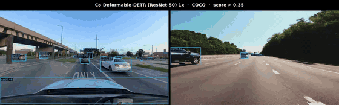

# Co-DETR — maintained fork

**[dronefreak/Co-DETR](https://github.com/dronefreak/Co-DETR)** is a
community-maintained fork of [Sense-X/Co-DETR](https://github.com/Sense-X/Co-DETR)
(DETRs with Collaborative Hybrid Assignments Training, ICCV 2023). The original
model code, configs, and reported results are kept intact; this fork adds
modern-Python/NumPy compatibility fixes, a one-command validated environment,
an end-to-end train / eval / inference pipeline for custom datasets, and
Hugging Face mirrors of the checkpoints. The original upstream README (paper
introduction, full SOTA model zoo incl. ViT-L / Objects365 / LVIS, original
instructions) is preserved at [`README.upstream.md`](README.upstream.md).

<p align="center">
  
</p>

<p align="center">
<a href="LICENSE"></a> <a href="tools/setup_codetr_env.sh"></a> <a href="tools/setup_codetr_env.sh"></a> <a href="https://github.com/open-mmlab/mmdetection/tree/v2.25.3"></a> <a href="https://arxiv.org/abs/2211.12860"></a>
<br>
<a href="https://huggingface.co/collections/dronefreak/co-dino-community-mirrors-6aa090c32ace71749a0033a9"></a> <a href="https://huggingface.co/collections/dronefreak/co-deformable-detr-community-mirrors-6aa090beab5d8c3f5bf37f44"></a>
</p>

---

## Quickstart: inference

```shell
# 1. one-command validated environment (Python 3.8 / torch 1.11.0+cu113 / mmcv-full 1.5.0)
bash tools/setup_codetr_env.sh
conda activate codetr

# 2. grab a checkpoint + its config from the Hub (any repo from the model zoo below)
pip install -U "huggingface_hub[cli]"
hf download dronefreak/co-dino-5scale-r50-1x-coco \
    co_dino_5scale_r50_1x_coco.pth co_dino_5scale_r50_1x_coco.py --local-dir checkpoints/

# 3. run detection — one CLI for image / folder / video / webcam (input type auto-detected)
python tools/inference.py \
    --config checkpoints/co_dino_5scale_r50_1x_coco.py \
    --checkpoint checkpoints/co_dino_5scale_r50_1x_coco.pth \
    --input demo/demo.jpg --out-dir outputs/ --save-json
```

```shell
# other input modes
python tools/inference.py --config <cfg> --checkpoint <ckpt> --input path/to/images/           # folder
python tools/inference.py --config <cfg> --checkpoint <ckpt> --input clip.mp4 --max-frames 300 # video file
python tools/inference.py --config <cfg> --checkpoint <ckpt> --input webcam --show --record    # live camera
```

`--save-json` writes raw detections (class, bbox, score) alongside the annotated
output. Full flag reference:
[`docs/en/tutorials/inference.md`](docs/en/tutorials/inference.md).

> **CUDA 12.x / PyTorch 2.x:** `mmcv-full` 1.x has no CUDA 12 wheels and is
> unverified against PyTorch 2 for this codebase. CUDA 11.3 (above) is the only
> end-to-end tested path.

---

## Training & evaluation

Point `--config` at any file under `projects/configs/{co_deformable_detr,co_dino}/`.
The COCO / LVIS layout expected under `data/` is documented in
[`README.upstream.md`](README.upstream.md#data). To train on your **own**
COCO-format dataset, follow
[`docs/en/tutorials/finetune_custom_dataset.md`](docs/en/tutorials/finetune_custom_dataset.md).

### Train

| | Command |
|---|---|
| Single GPU | `python tools/train.py <config> --work-dir <exp_dir>` |
| Multi-GPU (N GPUs) | `bash tools/dist_train.sh <config> <N> <exp_dir>` |
| Slurm | `bash tools/slurm_train.sh <partition> <job_name> <config> <exp_dir>` |

```shell
# example: Co-DINO R50, 4 GPUs
bash tools/dist_train.sh projects/configs/co_dino/co_dino_5scale_r50_1x_coco.py 4 work_dirs/co_dino_r50
```

### Evaluate

| | Command |
|---|---|
| Single GPU (clean summary) | `python tools/eval.py <config> <checkpoint> --eval bbox --work-dir <out>` |
| Single GPU (raw mmdet) | `python tools/test.py <config> <checkpoint> --eval bbox` |
| Multi-GPU (N GPUs) | `bash tools/dist_test.sh <config> <checkpoint> <N> --eval bbox` |
| Slurm | `bash tools/slurm_test.sh <partition> <job_name> <config> <checkpoint> --eval bbox` |

```shell
# example: evaluate a downloaded checkpoint on COCO val2017, 4 GPUs
bash tools/dist_test.sh projects/configs/co_dino/co_dino_5scale_r50_1x_coco.py \
    checkpoints/co_dino_5scale_r50_1x_coco.pth 4 --eval bbox
```

`tools/eval.py` is a fork-added single-GPU wrapper around `tools/test.py` that
prints a readable metrics table; see
[`docs/en/tutorials/evaluate_custom_dataset.md`](docs/en/tutorials/evaluate_custom_dataset.md).
Use `--eval bbox segm` for the LVIS instance configs.

---

## Model zoo (mirrored to Hugging Face)

Every non-ViT COCO checkpoint from the upstream zoo, mirrored to a per-model Hub
repo. Each repo carries the weights, a **self-contained flattened** config,
`config.json`, and a demo banner generated with that checkpoint. **box AP is the
authors' COCO `val2017` number, carried from the paper / official model zoo — it
has not been re-evaluated in this fork.** Collections:
[Co-DINO](https://huggingface.co/collections/dronefreak/co-dino-community-mirrors-6aa090c32ace71749a0033a9)
·
[Co-Deformable-DETR](https://huggingface.co/collections/dronefreak/co-deformable-detr-community-mirrors-6aa090beab5d8c3f5bf37f44).

### Co-Deformable-DETR (COCO `val2017`)

| Backbone | Schedule | Queries | box AP | 🤗 Mirror | Config |
|---|---|---|---|---|---|
| ResNet-50 | 1x (12 ep) | 300 | 49.5 | [`co-deformable-detr-r50-1x-coco`](https://huggingface.co/dronefreak/co-deformable-detr-r50-1x-coco) | [cfg](projects/configs/co_deformable_detr/co_deformable_detr_r50_1x_coco.py) |
| Swin-T | 1x (12 ep) | 300 | 51.7 | [`co-deformable-detr-swin-t-1x-coco`](https://huggingface.co/dronefreak/co-deformable-detr-swin-t-1x-coco) | [cfg](projects/configs/co_deformable_detr/co_deformable_detr_swin_tiny_1x_coco.py) |
| Swin-T | 3x (36 ep) | 300 | 54.1 | [`co-deformable-detr-swin-t-3x-coco`](https://huggingface.co/dronefreak/co-deformable-detr-swin-t-3x-coco) | [cfg](projects/configs/co_deformable_detr/co_deformable_detr_swin_tiny_3x_coco.py) |
| Swin-S | 1x (12 ep) | 300 | 53.4 | [`co-deformable-detr-swin-s-1x-coco`](https://huggingface.co/dronefreak/co-deformable-detr-swin-s-1x-coco) | [cfg](projects/configs/co_deformable_detr/co_deformable_detr_swin_small_1x_coco.py) |
| Swin-S | 3x (36 ep) | 300 | 55.3 | [`co-deformable-detr-swin-s-3x-coco`](https://huggingface.co/dronefreak/co-deformable-detr-swin-s-3x-coco) | [cfg](projects/configs/co_deformable_detr/co_deformable_detr_swin_small_3x_coco.py) |
| Swin-B | 1x (12 ep) | 300 | 55.5 | [`co-deformable-detr-swin-b-1x-coco`](https://huggingface.co/dronefreak/co-deformable-detr-swin-b-1x-coco) | [cfg](projects/configs/co_deformable_detr/co_deformable_detr_swin_base_1x_coco.py) |
| Swin-B | 3x (36 ep) | 300 | 57.5 | [`co-deformable-detr-swin-b-3x-coco`](https://huggingface.co/dronefreak/co-deformable-detr-swin-b-3x-coco) | [cfg](projects/configs/co_deformable_detr/co_deformable_detr_swin_base_3x_coco.py) |
| Swin-L | 1x (12 ep) | 300 | 56.9 | [`co-deformable-detr-swin-l-1x-coco`](https://huggingface.co/dronefreak/co-deformable-detr-swin-l-1x-coco) | [cfg](projects/configs/co_deformable_detr/co_deformable_detr_swin_large_1x_coco.py) |
| Swin-L | 3x (36 ep) | 900 | 58.5 | [`co-deformable-detr-swin-l-900q-3x-coco`](https://huggingface.co/dronefreak/co-deformable-detr-swin-l-900q-3x-coco) | [cfg](projects/configs/co_deformable_detr/co_deformable_detr_swin_large_900q_3x_coco.py) |

### Co-DINO — 5-scale (COCO `val2017`)

| Backbone | Schedule | box AP | 🤗 Mirror | Config |
|---|---|---|---|---|
| ResNet-50 | 1x (12 ep) | 52.1 | [`co-dino-5scale-r50-1x-coco`](https://huggingface.co/dronefreak/co-dino-5scale-r50-1x-coco) | [cfg](projects/configs/co_dino/co_dino_5scale_r50_1x_coco.py) |
| ResNet-50 · LSJ | 1x (12 ep) | 52.1 | [`co-dino-5scale-lsj-r50-1x-coco`](https://huggingface.co/dronefreak/co-dino-5scale-lsj-r50-1x-coco) | [cfg](projects/configs/co_dino/co_dino_5scale_lsj_r50_1x_coco.py) |
| ResNet-50 · LSJ | 3x (36 ep) | 54.8 | [`co-dino-5scale-lsj-r50-3x-coco`](https://huggingface.co/dronefreak/co-dino-5scale-lsj-r50-3x-coco) | [cfg](projects/configs/co_dino/co_dino_5scale_lsj_r50_3x_coco.py) |
| ResNet-50 · LSJ · 9-enc | 1x (12 ep) | 52.6 | [`co-dino-5scale-9encoder-lsj-r50-1x-coco`](https://huggingface.co/dronefreak/co-dino-5scale-9encoder-lsj-r50-1x-coco) | [cfg](projects/configs/co_dino/co_dino_5scale_9encoder_lsj_r50_1x_coco.py) |
| ResNet-50 · LSJ · 9-enc | 3x (36 ep) | 55.4 | [`co-dino-5scale-9encoder-lsj-r50-3x-coco`](https://huggingface.co/dronefreak/co-dino-5scale-9encoder-lsj-r50-3x-coco) | [cfg](projects/configs/co_dino/co_dino_5scale_9encoder_lsj_r50_3x_coco.py) |
| Swin-L | 1x (12 ep) | 58.9 | [`co-dino-5scale-swin-l-1x-coco`](https://huggingface.co/dronefreak/co-dino-5scale-swin-l-1x-coco) | [cfg](projects/configs/co_dino/co_dino_5scale_swin_large_1x_coco.py) |
| Swin-L | 2x (24 ep) | 59.8 | [`co-dino-5scale-swin-l-2x-coco`](https://huggingface.co/dronefreak/co-dino-5scale-swin-l-2x-coco) | [cfg](projects/configs/co_dino/co_dino_5scale_swin_large_2x_coco.py) |
| Swin-L | 3x (36 ep) | 60.0 | [`co-dino-5scale-swin-l-3x-coco`](https://huggingface.co/dronefreak/co-dino-5scale-swin-l-3x-coco) | [cfg](projects/configs/co_dino/co_dino_5scale_swin_large_3x_coco.py) |
| Swin-L · LSJ | 1x (12 ep) | 59.3 | [`co-dino-5scale-lsj-swin-l-1x-coco`](https://huggingface.co/dronefreak/co-dino-5scale-lsj-swin-l-1x-coco) | [cfg](projects/configs/co_dino/co_dino_5scale_lsj_swin_large_1x_coco.py) |
| Swin-L · LSJ | 3x (36 ep) | 60.7 | [`co-dino-5scale-lsj-swin-l-3x-coco`](https://huggingface.co/dronefreak/co-dino-5scale-lsj-swin-l-3x-coco) | [cfg](projects/configs/co_dino/co_dino_5scale_lsj_swin_large_3x_coco.py) |

**Not mirrored:** the ViT-L records (up to 66.0 AP COCO test-dev), the
Objects365-pretrained Swin-L, and the LVIS checkpoints. Those are on the
authors' Hub ([`zongzhuofan`](https://huggingface.co/zongzhuofan)) and listed in
[`README.upstream.md`](README.upstream.md#model-zoo-original-full).

---

## Changelog

- NumPy ≥ 1.24 support: removed deprecated `np.float`/`np.int`/`np.bool`/`np.object` aliases (33 uses across 14 files).
- Python ≥ 3.10 support: fixed a removed `collections.abc` import in `tools/misc/browse_dataset.py`.
- `torch.load` compat shim (`mmdet/utils/torch_compat.py`): checkpoint loading works from PyTorch 1.11 through current releases.
- Raised the supported `mmcv` ceiling to 1.7.2 and refreshed stale requirement pins.
- `tools/setup_codetr_env.sh`: one command builds a validated `codetr` conda env (Python 3.8, torch 1.11.0+cu113, mmcv-full 1.5.0).
- `requirements/codetr.txt` + `requirements/codetr_freeze.txt`: top-level pins and an exact freeze.
- `tools/inference.py`: one CLI for image / folder / video / webcam (mode auto-detected), optional JSON export, `--max-frames`, `--record`.
- `tools/eval.py`: single-GPU wrapper around `tools/test.py` with a clean metrics summary table.
- Custom-dataset templates: `projects/configs/_base_/datasets/custom_coco_detection.py` and `projects/configs/co_dino/co_dino_5scale_r50_1x_custom_dataset.py`.
- New tutorials under `docs/en/tutorials/`: `finetune_custom_dataset.md`, `evaluate_custom_dataset.md`, `inference.md`.
- Mirrored all 19 non-ViT COCO checkpoints to per-model Hugging Face repos with model cards, flattened configs, and per-model demo banners.
- Restructured this README; the original upstream README is preserved as [`README.upstream.md`](README.upstream.md).

**Verified:** every mirrored checkpoint loads with a full state-dict key match in
the `codetr` env; all four `tools/inference.py` input modes exercised. Vendored
`tests/` suite: 369 passed / 38 failed (all failures pre-existing — missing
fixture data or uninstalled optional deps — none from fork changes).

---

## Attribution

- **[Co-DETR](https://github.com/Sense-X/Co-DETR)** (Zhuofan Zong, Guanglu Song,
  Yu Liu — SenseTime X-Lab): the original method, implementation, and paper this
  repo is forked from. All credit for Co-DETR itself belongs to the original
  authors; please cite the [paper](#cite).
- **[MMDetection](https://github.com/open-mmlab/mmdetection)** /
  **[MMCV](https://github.com/open-mmlab/mmcv)** (OpenMMLab): the detection
  framework and op library this codebase is built on. MMDetection 2.25.3 is
  vendored in `mmdet/`.
- **Mirrored weights**: the checkpoints in the model zoo above were trained and
  released by the original authors (Google Drive / the `zongzhuofan` Hub). This
  fork does not claim authorship of those weights; each mirror repo declares
  `license: unknown` and links back to the source. See any mirror's card for the
  full provenance and SHA-256.
- Fork additions (compatibility fixes, environment, tooling, docs, mirrors) are
  released under the same [MIT license](LICENSE) as the rest of the repository.

## Cite

```bibtex
@inproceedings{zong2023detrs,
  title={DETRs with Collaborative Hybrid Assignments Training},
  author={Zong, Zhuofan and Song, Guanglu and Liu, Yu},
  booktitle={Proceedings of the IEEE/CVF International Conference on Computer Vision (ICCV)},
  pages={6748--6758},
  year={2023}
}
```
